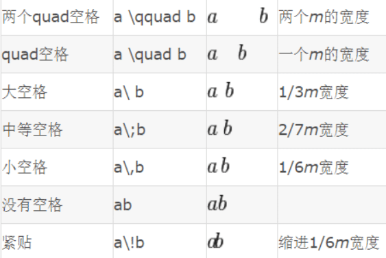
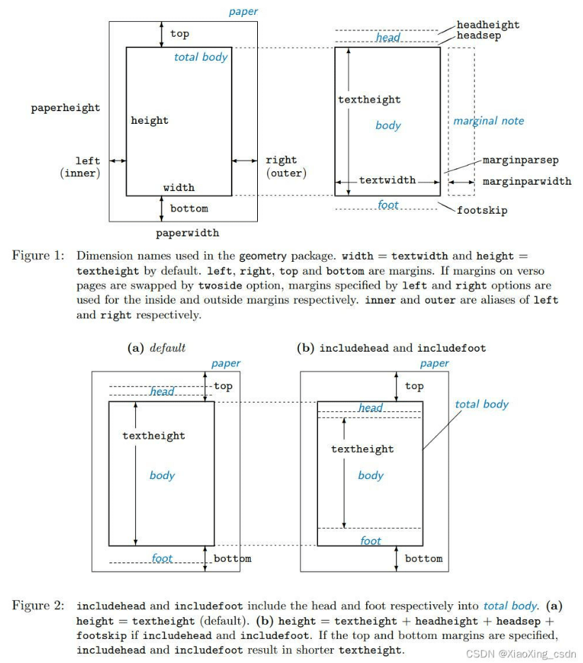
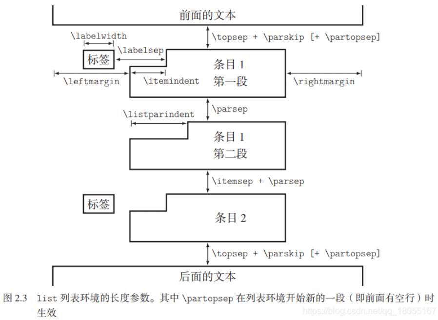

- [1. 语法](#1-语法)
- [2. 文章/段落](#2-文章段落)
- [3. 图片](#3-图片)
- [4. 表格](#4-表格)

# 1. 语法
* 空格 
* 括号注意事项：
  + `\Bigg (`、`\bigg [`、`\Big \{`、`\big \langle`
  + 混合括号：`\left ( x \right ]`
  + 单侧括号：`\left ( x \right .`
* `\newcommand{<命令名称>}[<参数个数>][<首参数默认值>]{<具体的定义>}`
* `\the`命令可以打印值，e.g. `\the\tabcolseq`打印出`6.0pt`，说明表格列之间默认间距6pt。
* `\forall\,`

# 2. 文章/段落
* [段落、标题行距控制](https://www.jianshu.com/p/d7848f815e5f)
  + `\addtolength{\parskip}{6pt}`
  + `\titleformat{<cmd>}{<shape>}{<format>}{<label>}{<seq>}{befor-code}{after-code}`
  + `\titlespacing{<command>}{<left>}{<before-sep>}{<after-sep>}[<right-sep>]`
* 算法伪代码Algorithm
  + 脚注
  + if-elseif-else，[参考](https://blog.csdn.net/Bule_Zst/article/details/88848102)
  + 以`end`结尾：`\eIf, \If, \Else, \ElseIf`
  + 不以`end`结尾的行形式：`\lIf, \lElseIf, \lElse`
  + 不以`end`结尾的块形式：`\uIf, \uElseIf, \uElse`
* 自定义一个命令比如说\revision，然后在开头定义这个\revision等于\blue。修改完成出最终稿的时候把定义改成\black就行了
  + `\newcommand{\revision}[1]{\textcolor{red}{#1}}`

* $TeX$页面定义


* `enumerate`距离定义


* 好用的符号&字体定义

```latex
\newcommand{\vecf}[1]{{\bf #1}}
\newcommand{\matf}[1]{{\bf #1}}
\newcommand{\fvarf}[1]{{\cal #1}}
\newcommand{\fvecf}[1]{{\mbox{\boldmath $\underline{#1}$}}}
\newcommand{\fmatf}[1]{{\mbox{\boldmath $\cal #1$}}}
\newcommand{\symvec}[1]{{\mbox{\boldmath $#1$}}}
\newcommand{\symmat}[1]{{\mbox{\boldmath $#1$}}}

\newcommand{\Courier}{\fontfamily{pcr}\selectfont }
\newcommand{\cmark}{\ding{51}}
\newcommand{\xmark}{\ding{55}}
```

# 3. 图片
* `caption`包的使用，[参考](https://www.jianshu.com/p/0a1c45a02120)，控制图表描述

```tex
\usepackage{caption}
\captionsetup[figure]{justification=centering, font=footnotesize}
\captionsetup[table]{justification=centering, labelsep=newline, font={footnotesize, sc}}
```

* `\protect \\`：caption或单元格内换行

# 4. 表格
* `\renewcommand\arraystretch{1.5}`：修改表格行高，其作用域是全局，而非下一个表格；推荐在`table`环境中使用`\setlength\extrarowheight{5pt}`设置。

* 复杂表格制作

```tex
%| a | b | c |
%|  1  |  2  |
\begin{table}[t]
    \setlength\tabcolsep{5pt}
    \setlength\extrarowheight{5pt}
    \newlength\lencell \newlength\lenbase \newlength\lengoal
    \settowidth{\lenbase}{six settings for $N$}
    \setlength{\lencell}{\dimexpr0.5\lenbase-\tabcolsep-\arrayrulewidth/2\relax}
    \setlength{\lengoal}{\dimexpr1.5\lenbase+\tabcolsep+\arrayrulewidth/2\relax}

    \newcolumntype{P}[1]{>{\centering\arraybackslash}p{#1}} % centered "p" column
    \newcommand\twocols[1]{\multicolumn{2}{P{\lenbase}}{#1}}  % handy shortcut macros
    \newcommand\twocolsL[1]{\multicolumn{2}{|P{\lenbase}}{#1}}
    \newcommand\threecols[1]{\multicolumn{3}{P{\lengoal}}{#1}}
    \newcommand\threecolsL[1]{\multicolumn{3}{|P{\lengoal}}{#1}}

    \centering
    \caption{\textcolor{myFirstRevision}{The twelve types of attackers adopted in this paper. An attacker is composed of a configuration of algorithm, parameter, knowledge and goal.}}
    \scalebox{0.98}{\begin{tabular}{l|*{6}{p{\lencell}}}
    \toprule
    \#algorithms & \twocols{BIM ($L_{\infty}$)}    & \twocolsL{PGD ($L_2$)}            & \twocolsL{CW (RMS)} \\
    \#parameters & \twocols{six settings for $N$}  & \twocolsL{six settings for $N$}   & \twocolsL{six settings for $\kappa$} \\
    \midrule
    \#knowledge  & \threecols{\textit{white-box} attack}    & \threecolsL{\textit{black-box} attack}  \\
    \#goals      & \threecols{\textit{impersonation}}       & \threecolsL{\textit{evasion}} \\
    \bottomrule
    \end{tabular}}
    \label{tab:attacker_types}
\end{table}
```

* `*{2}{p{12pt}<{\centering}}`等价与`p{12pt}<{\centering}} p{12pt}<{\centering}}`
* 精确控制行与行之间距离：`\specialrule{0em}{2pt}{2pt}`或者在`\\`后面直接加`[1ex]`，两者效果等同
