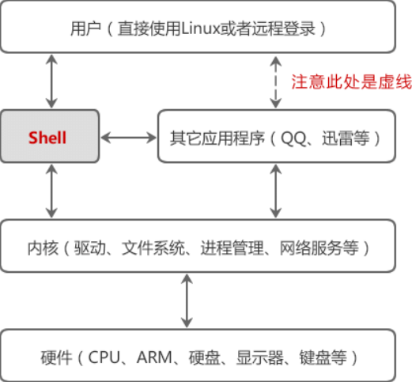
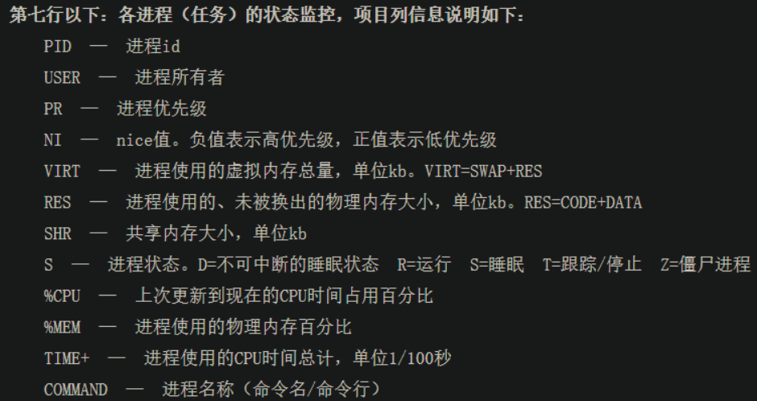

- [1. Linux常识](#1-linux常识)
- [2. 常用命令要点](#2-常用命令要点)
  - [路径相关](#路径相关)
  - [文本处理](#文本处理)
  - [系统](#系统)
  - [其他命令](#其他命令)
  - [组合命令（熟能生巧）](#组合命令熟能生巧)
- [3. Shell语法](#3-shell语法)
  - [基础知识](#基础知识)
  - [奇技淫巧](#奇技淫巧)
- [4. perl语法](#4-perl语法)
  - [基础知识](#基础知识-1)
  - [奇技淫巧](#奇技淫巧-1)

# 1. Linux常识

> shell本质上是连接用户和Linux内核的应用程序，既简化用户操作，又保障内核安全。

* **图解Shell** 

* `grep`更适合单纯的**查找**文本
* `sed`更适合**编辑**匹配到的文本
* `awk`更适合对文本进行较复杂的**格式化**
* top命令 

# 2. 常用命令要点

## 路径相关

* `readlink`：定位软链接地址
* `find`：`-L`软链接，`-iname`忽略大小写，`-type`查找类型`d,f,l`分别对应目录、常规文件、软链接；查找多个匹配项，e.g. `find -name *.mp4 -o -name *.pkl`，`find . -name "file*"`当前目录查找必须用双引号
* `basename`：`-s .flac`去除后缀名，如果紧跟`.flac`也会默认移除后缀名
* `dirname`：获取目录名称

## 文本处理

* `cut`：按行提取想要文本，`-b, -c, -f`（字节、字符、字段）必须有一个；`-d`表示分隔符，默认是`TAB`；e.g. `cut -f 2-`（`cut -f-2`）分别表示提取第二行之后（之前）的内容，`-`表示无视分隔符
* `tr`：删除/替换标准输入，e.g. `cat FILE | tr a-z A-Z`是将`FILE`中的小写字符替换为大写
* [`awk`](https://www.runoob.com/linux/linux-comm-awk.html)：`-F,`分割符，`NF`单行字段数目，`NR`行号（从1开始），`$0`完整输入，`$n`当前记录的第n个字段，`awk 'BEGIN{} {} END {}'`
* `sed`：常用替换/查找，e.g. `sed -e "1s/^\///g" -e "2,3s/\/$//g" FILE`，删除第1行开头和第2-3行结尾的`/`字符，e.g. `cat FILE | sed -n "/^T/p"`查找以`T`开头行并打印；使用管道符`|`,  `-f <script-file>`, 多个`-e <script>`,  `;`来匹配多个模式
* [`grep`](https://blog.csdn.net/jackaduma/article/details/6900242)：或操作，`grep 'p1\|p2'`、`grep -E 'p1|p2'`、`egrep 'p1|p2'`、`grep -e p1 -e p2`；与操作，`grep p1 | grep p2`、`egrep 'p1.*p2|p2.*p1'`；非操作，`-v`
* `shuf`：按行随机打乱文本，e.g. `shuf IN -o OUT`，IN和OUT可以是标准输入输出
* `cat FILE | head -n10` v.s. `head -n10 FILE`，前者head在读取完会关闭管道，导致`exit 141`
* `find PATH -type d | grep -Ev "^h|t$"`：`-v`查找不匹配的路径（convert），`-E`多个匹配
* `split -l $NUM -d -a3 $FILE $PREFIX`：`-l`表示行数，`-d`数字形式，`-a3`三位
* `paste -d " " $FILE -`：按分隔符将`FILE`和标准输入，写到标准输出

## 系统

* `du -hd1 DIR`：按照深度列出目录`DIR`占用空间，默认`DIR`为当前目录
* `df -h`：列出磁盘使用详情
* `tar -C DIR -xvzf FILE.tar.gz`：`-C`提供解压目录
* `unzip -d DIR FILE.zip`：`-d`提供解压目录，`-q`表示quiet
* `arch`和`uname -a`：查看Linux Architecture
* `lsb_release -a`和`cat /etc/os-release`：查看Ubuntu版本
* `nvcc -V`：查看CUDA版本
* `cat /usr/local/cuda/include/cudnn_version.h`：查看cudnn版本
* `nvidia-smi -L`和`lspci |grep -i nvidia`：查看显卡
* `fuser -v /dev/nvidia*`：查看阻塞的显卡（内存占满但GPU利用率为零）

```bash
# 一般情况下，<逻辑CPU> = <物理CPU> * <每块CPU核心数>
# 如果不相等，表示服务器CPU支持超线程技术，e.g. 96 = 2 * 24 * 2
grep "physical id" /proc/cpuinfo | sort | uniq | wc -l  # 物理CPU个数
grep "cpu cores" /proc/cpuinfo | sort | uniq  # 每块CPU核心数
grep "processor" /proc/cpuinfo | wc -l  # 逻辑CPU个数
```

* `ps -u xing.chen`：用户的所有进程；`ps -o pgid $PID`查看进程组id
* `pstree -u xing.chen`：以树状显示用户进程

## 其他命令

* `wc -l FILE`：返回FILE行数
* `xargs`：`-i`默认使用`{}`代替，e.g. `-i$`；`-I`必须提供替换符号，e.g. `-I %`
* `seq -s"# " -w 10`：输出`01# 02# ... 09# 10`；其中，`-s`表示分隔符，`-w`表示向前补零对齐长度
* `noise_dir=$(eval echo '$'"${noise}_dir")`：`eval`拼接字符串，得到变量值
* `nohup` v.s. `screen`：如果是多进程，`nohup`会因为当前窗口关闭而中断程序
  + `screen -S <name>`，`-r, -ls，-d`分别表示恢复，列出，剥离（相当于Ctrl+A, D）
  + `screen -X -S <pid.name.host> quit` or `kill <pid>`都可以删除会话

## 组合命令（熟能生巧）

* `tar -tvf extensions.tar | grep ^d | awk -F/ '{if(NF==4) print $3}'`，查看.tar文件一级目录
* `num=0; for f in $(fine DIR -type f); do [ -x $f ] && num=$((num+1)); done; echo $num`，查找`DIR`目录下的可执行文件
* `echo $PATH | awk -F":" '{for(i=1;i<=NF;i++) print $i}' | sort`，直观查看`PATH`内容
* `find $KALDI_PATH/src -perm -111 -type f | xargs -i ln -s {} ~/.local/.kaldibin`，将kaldi所有可执行文件软链接到指定目录，便于查看
* `fuser -v /dev/nvidia4* | awk '{for(i=1;i<=NF;i++) print "kill -9 ", $i;}' | bash`，杀死意外中断后仍然占用GPU的进程

# 3. Shell语法

## 基础知识

* 变量定义
  + `$(var:-default)`：当var为空或未定义时，表达式为default
  + `$(var:=default)`：当var为空或未定义时，表达式和var值为default
  + `$(var=?message)`：当var为空或未定义时，打印错误信息message
  + `$(var-default)`：当且仅当var未定义时，表达式为default
  + `$(var=default)`：当且仅当var未定义时，表达式和var值为default
  + `$(var?message)`：当且仅当var未定义时，打印错误信息message
  + `$(var+default)`：当var已定义时，表达式为default
  + `$(var:+default)`：当var已定义且非空时，表达式为default

* 单引号原样输出、双引号转义后输出（`\$`与`$`的区别）
  + `echo "abc "\$" t"`：双中有双必须转义，否则`$`输出空，即`abc  t`
  + `echo 'abc '\$' t'`：单中有单必须转义，输出同上，即`abc $ t`
  + `echo "abc '\$' t"`：双中有单无须转义，两者输出一样，即`abc '$' t`
  + `echo 'abc "\$" t'`：单中有双无须转义，原样输出两者不一样，即`abc "\$" t`和`abc "$" t`

## 奇技淫巧

* shell中`(), [], {}`的作用：
  + 圆括号`()`：命令组（在子shell中运行）、命令替换`$(CMD)`；
  + 双圆括号`(())`：运算符和表达式符合C的运算规则即可；
  + 方括号`[]`：`[`和`test`等效，`]`表示关闭条件判断；
  + 双方括号`[[]]`：`[[`是bash的关键字，内容会发生命令替换，且支持字符串的模式匹配，e.g. `[[ hello==hell? ]]`；
  + 花括号`{}`：
    - 大括号拓展：`{a,c}.txt`，`{a..c}.txt`
    - 代码块：内部命令不会在子shell运行
    - 四种模式匹配替换结构：e.g. `f=noise-bim-linf`，`${f#*-}=bim-linf`，`${f##*-}=linf`，而`${f%-*}=noise-bim`，`${f%%-*}=noise`。注解：`#`在前`%`在后，一个是最小匹配，二个是最大匹配
    - 字符串提取和替换：`${var: -2}, ${var:1-2}, ${var:(-2)}`，取末尾两个字符；`${var/p/P}, ${var//p/P}`，将第一个（所有）`p`用`P`替换
* `shift`会影响`$#`（输入参数个数）的值
* 多行注释，[参考](https://blog.csdn.net/qianggezhishen/article/details/51981804)：`<<'COMMENT' ANYTHING COMMENT`
* `${!prefix*}、${!prefix@}`：返回带有前缀为`prefix`的变量名
* `${!arr[@]}、${!arr[*]}`：返回数组arr的所有下标，arr不是数组则返回0，不存在则返回空
* `cmd1 && cmd2 || cmd3`：利用`&&`优先级高于`||`来实现三目运算
* `while read -r VAL; do ... done < IN_FILE > OUT_FILE`，e.g. `wespeaker, examples/voxconverse/v1/run.sh#L72-L76`

```shell
while read -r utt wav_path; do
    python3 sad/make_oracle_sad.py \
          --rttm data/voxconverse-master/dev/${utt}.rttm \
          --min-duration $min_duration
done < data/dev/wav.scp > data/dev/oracle_sad
```

# 4. perl语法

## 基础知识

* [基础语法参考](https://www.jianshu.com/p/20e7dd5c458d)
* `$, @, %`分别表示变量、数组、字典
* `$_`表示默认参数，指程序处理的上一个变量；`@_`表示函数传参时的参数数组；e.g. `my($param1, $param2)=@_`
* 运算符：`.`用于连接字符串；`..`是范围运算符，e.g. `(2..5)`输出`(2,3,4,5)`；`('r' x 3)`输出`rrr`
* `push, pop`表示从数组尾部加入/取出元素；`unshift, shift`表示从数组头部加入/取出元素

## 奇技淫巧

```perl
while(<>) {
  foreach $p (split(" ", $_)) {
    $p =~ m:^([^\d]+)(\d*)$: || die "Bad phone $_";
    $q{$2} .= "$p ";
  }
}
```

* [读取输入](https://www.cnblogs.com/f-ck-need-u/p/9511892.html)、[正则表达式](https://www.jianshu.com/p/99bb2cfe7f12)
  + `<>`表示读取标准输入,  `<<>>`更安全
  + 正则表达式：`m//`表示匹配、`s///`表示替换、`tr///`表示转化；`=~`表示匹配、`!~`表示不匹配；[菜鸟教程](https://www.runoob.com/perl/perl-regular-expressions.html)
  + 正则表达式：`^,$`分别匹配开头和结尾；`()`用于模式分组；`[^\d]+`表示匹配除数字外的多个字符；`\d*`表示匹配0次或多次数字字符

* [`next if语法`](https://juejin.cn/s/perl%20next%20if%E7%94%A8%E6%B3%95)，perl中常用的控制结构，用于在循环中跳过某些条件
