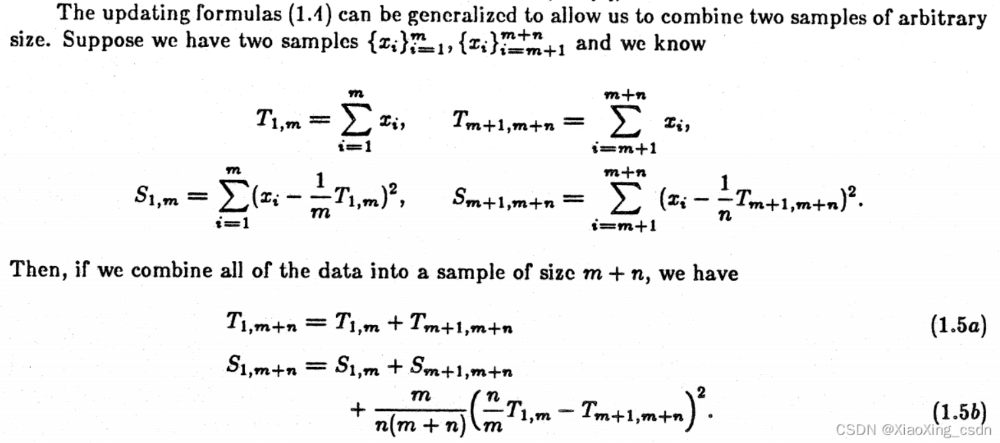

- [1. 基础及语法](#1-基础及语法)
- [2. 奇技淫巧](#2-奇技淫巧)
- [3. 源码原理](#3-源码原理)
  - [DDP并行](#ddp并行)
  - [Dropout为什么要缩放](#dropout为什么要缩放)
  - [梯度累加节省内存小Trick](#梯度累加节省内存小trick)
  - [GAN训练技巧，参考代码](#gan训练技巧参考代码)
  - [Dyning ReLU](#dyning-relu)
- [4. 错误集锦](#4-错误集锦)

# 1. 基础及语法
* `nvcc -V`：查看cuda版本，或者通过`watch nvidia-smi`查看
* [Pytorch使用不同版本的cuda](https://www.cnblogs.com/yhjoker/p/10972795.html)
  + Pytorch确定cuda的过程：`CUDA_HOME/CUDA_PATH`环境变量 >> `/usr/local/cuda`软链接指向 >> `which nvcc`对应的cuda路径
  + 在确定好使用的 cuda 路径后，基于 cuda 的 Pytorch 拓展即会使用确定好的 cuda 目录中的可执行文件( /bin )、头文件( /include )和库文件( /lib64 )完成所需的编译过程
  + 查看当前cuda版本
    1. `torch.version.cuda`：上述输出的 cuda 的版本并不一定是 Pytorch 在实际系统上运行时使用的 cuda 版本，而是编译该 Pytorch release 版本时使用的 cuda 版本
    2. `conda list | grep pytorch`若系统上的 Pytorch 通过 conda 安装，用户也可以直接通过命令查看安装的 Pytorch 的部分信息
    3. `torch.utils.cpp_extension.CUDA_HOME`：Pytorch实际使用的运行时的cuda目录

# 2. 奇技淫巧
* `nn.AdaptiveAvgPool1d(output_size)`：已知池化层的`kernal_size, stride, padding`和`input_size`可得到`output_size`。加下面约束条件可倒推`kernal_size`：
  > $stride=$`floor`$(input\_size/output\_size)$
  > $kernel\_size=input\_size−(output\_size−1)∗stride$
  > $padding=0$
* `nn.Module`：如果里面没有定义模型`nn.Module`或者参数`nn.Paramters`，但继承了`nn.Module`，在`.to()device`时会报错。此时可以使用`__call__`回调。
* [Pytorch设置随机种子](https://zhuanlan.zhihu.com/p/76472385)，使得模型的训练结果始终保持一致。
  + 注意：默认情况下，Python同进程的线程间共享一个种子，可能使得数据增强失效。[参见](https://mp.weixin.qq.com/s/TUSNq6ZTutZnay0KPjzdgw)。
  + 解决方法：`torch.utils.data.Dataloader(worker_init_fn=_self_define_)`

```python
if args.seed is not None:
    random.seed(args.seed)
    torch.manual_seed(args.seed) # 为CPU设置种子，用于生成随机数，使得每次训练初始化参数固定
    torch.cuda.manual_seed(args.seed) # 为当前GPU设置种子，作用同上
    torch.cuda.manual_seed_all(args.seed) # 为所有GPU设置种子，作用同上
    cudnn.deterministic = True
```

* `torch.nn.functional.conv_transpose1d()`
  + **上采样方法**：最近邻插值(Nearest neighbor interpolation)、双线性插值(Bi-Linear interpolation)、双立方插值(Bi-Cubic interpolation)
  + [转置卷积](https://blog.csdn.net/LoseInVain/article/details/81098502)，神经网络学习，是在随机初始化的基础上进行优化
* `.to(device)`与`.requires_grad_(True)`的先后有区别
* `.to(device)`or`.cuda()`使用场景及作用：
  + 将数据或者模型内部数据（子模块的`Parameter、Buffer`对象的成员变量）迭代送入GPU
  + 损失函数到底需不需要送入GPU，如果是自定义包含参数，则需要。
* 梯度裁剪

```python
if self.config["discriminator_grad_norm"] > 0:
        torch.nn.utils.clip_grad_norm_(
        self.model["discriminator"].parameters(),
        self.config["discriminator_grad_norm"])
```

* `torch.nn.Module, apply`使用方法

```python
def apply_weight_norm(self):
"""Apply weight normalization module from all of the layers."""
def _apply_weight_norm(m):
    if isinstance(m, torch.nn.Conv1d) or isinstance(m, torch.nn.Conv2d):
        torch.nn.utils.weight_norm(m)
        logging.debug(f"Weight norm is applied to {m}.")

self.apply(_apply_weight_norm)
```

* `torch.cat, torch.concat, torch.stack`的区别
  + `cat`和`concat`相同，在给定维度拼接，e.g. `A -> [3, 4], cat([A, A], dim=1) -> [3, 8]`
  + `stack`，在新维度拼接，e.g. `A -> [3, 4], stack([A, A], dim=2) -> [3, 4, 2]`
* `torch.nn.functional.one_hot(tensor, num_classes)`

* pytorch梯度
  + 注意要点：`requires_grad、retain_graph、volatile、register_hook`
  + [注册钩子函数](https://zhuanlan.zhihu.com/p/34298983)，一般在提取中间层参数来进行可视化、当我们想要保存中间参数变量、想要在传播过程中改变梯度值的时候使用。
  + 一般每个`forward`对应一个`backward`，若需要多次`backward`，则`retain_graph`。
  + [参考链接：解决OOM](https://stackoverflow.com/questions/47120126/how-to-calculate-loss-over-a-number-of-images-and-then-back-propagate-the-averag)
  + 只能获得`requires_grad=True`的叶节点的梯度值，其他叶节点梯度值`node_leaf_no.grad=None`；只要其中一个父节点`requires_grad=True`，经过运算后的`requires_grad`也必等于`True`；PyTorch默认在经过`backward`之后，清除/释放计算图以节省内存，除非`retain_graph=True`。

```python
# 1. 求梯度
import torch
x = torch.tensor([1., .2, 3.0], requires_grad=True)
y = torch.mean(x**2+1)
if x.grad is not None: x.zero_grad()	# 对梯度信息清零：因为Pytorch构建的动态图，为节约内存，每次迭代完成计算图被释放
y.backward(retain_graph=True)	# 后向传播，但不能释放计算图；弊病：会导致OOM，解决办法见下面参考链接
grad_y2x = x.grad

# 2. 求偏导，需要传入系数
from torch.autograd import Variable
x = Variable(torch.FloatTensor([1, 2]), requires_grad=True)
y = torch.FloatTensor(2)
y[0] = x[0]**2+x[1]*3
y[1] = x[0]*2+x[1]**2
jacobian_y2x = torch.FloatTensor(2, 2)
# 注意：输出梯度维度要和系数维度一致
y.backward(torch.FloatTensor([1, 0]), retain_graph=True)
jacobian_y2x[0,:] = x.grad
x.grad.zero_()
y.backward(torch.tensor([0., 1.]))
jacobian_y2x[1,:] = x.grad
```

* 保存模型：全量保存&参数保存

```python
# 1.全量保存
torch.save(model_obj, 'model.pth')
model = torch.load('model.pth')
# 2.参数保存
torch.save(model_obj.state_dict(), 'params.pth')
model = Model()
model.load_state_dict(torch.load('params.pth'))
model.eval() # 注意：一定要加，否则模型效果很差
```

* `with torch.no_grad()`
  + 上下文管理器，用于停止自动求导；被该语句wrap的部分，不会track梯度
  + 如在测试阶段，可以使整个网络停止自动求导，大大加速测试过程
  + [嵌套环境，遵循就近原则](http://www.iis7.com/a/nr/wz/202106/13944.html)

# 3. 源码原理
* `sklearn.preprocessing.StandardScaler().patial_fit()`原理


* `BatchNormalization`：其作用对网络中间的每层进行归一化处理，并且使用变换重构（Batch Normalization Transform）保证每层提取的特征分布不会被破坏。训练是针对每个mini-batch的，但是测试是针对单张图片的，即不存在batch的概念。训练计算每个batch数据的均值和方差；而测试时直接使用训练得到的均值和方差
* `Dropout`：其作用克服Overfitting，可以明显的减少过拟合现象。在每个训练批次中，以保留概率p使用部分激活单元；而测试时使用所有激活单元
* `model.train()`启用*BatchNormalization*、*Dropout*；`model.eval()`则不启用

## DDP并行

* `torchrun, torch.distributed.launch, torch.multiprocess.spawn, shell-wait`
* `nnodes, node_rank, nproc_per_node`
* `rank, local_rank, world_size`
* backend：`nccl, gloo, mpi`
* init_method：`env://, tcp://localhost:port, file://`
* 官方实践：每个进程分配一张卡，性能最好
* **梯度平均推导**
  + 假设训练集为$X$，分别以`batch_size`为$N_1$和$N_2$，从中取出数据$X_1$和$X_2$，模型$f$初始参数为$\theta_0$
  + 正常训练情况下，`batch_size`为$N_1+N_2$，训练损失和其对参数$\theta$的梯度如下：
    - $\mathcal{L}=\frac{1}{N_1+N_2}\biggl(\sum\limits_{i}^{N_1}f\left(X_1^i;\,\theta_0\right) + \sum\limits_{i}^{N_2}f\left(X_2^i;\,\theta_0\right)\biggr)$
    - $g=\frac{\partial{\mathcal{L}}}{\partial{\theta_0}}=\frac{1}{N_1+N_2}\biggl(\sum\limits_{i}^{N_1}\frac{\partial{f}\left(X_1^i;\,\theta_0\right)}{\partial{\theta_0}} + \sum\limits_{i}^{N_2}\frac{\partial{f}\left(X_2^i;\,\theta_0\right)}{\partial{\theta_0}}\biggr)$
  + 分batch训练情况下，训练损失和梯度分别如下：
    - $\mathcal{L}_1=\frac{1}{N_1}\sum\limits_{i}^{N_1}f\left(X_1^i;\,\theta_0\right)$，$\mathcal{L}_2=\frac{1}{N_2}\sum\limits_{i}^{N_2}f\left(X_2^i;\,\theta_0\right)$

    - $g_1=\frac{1}{N_1}\sum\limits_{i}^{N_1}\frac{\partial{f}\left(X_1^i;\,\theta_0\right)}{\partial{\theta_0}}$，$g_2=\frac{1}{N_2}\sum\limits_{i}^{N_2}\frac{\partial{f}\left(X_2^i;\,\theta_0\right)}{\partial{\theta_0}}$
  + 梯度同步操作（实际就是梯度平均）：
    - $g=\frac{N_1 g_1 + N_2 g_2}{N1+N2}=\frac{1}{2}\left(g_1 + g_2\right)$，当$N_1=N_2$时成立
  + DP和DDP的区别在于：
    - DP是中心化的，主卡将子卡的梯度收集过来，进行平均之后，再广播到子卡
    - DDP是去中心化的，通过环结构相连，传播N-1次后，在子卡做梯度平均
* 其他特性：去中心化、同步异步、精度

## Dropout为什么要缩放

* 本质上是为了保证训练和测试阶段，输出分布的期望相同
* 在forward、backward、predict过程中，dropout的计算有所不同
* 假设输入序列为：$X=[x_0, x_1, x_2, x_3]$，正常回溯的梯度为：$G=[g_0, g_1, g_2, g_3]$，以概率$p$进行dropout
* `Vanilla Dropout`
  + forward时输入为$X=[x_0, 0, x_2, x_3]$
  + backward时梯度为$G=[g_0, 0, g_2, g_3]$
  + predict时输入为$X^{\prime}=(1-p)X$
* `Inverted Dropout`
  + forward时输入为$X=\frac{1}{1-p}\; [x_0, 0, x_2, x_3]$
  + backward时梯度为$G=\frac{1}{1-p}\; [g_0, 0, g_2, g_3]$
  + predict时输入为$X^{\prime}=X$

## 梯度累加节省内存小Trick

* 相当于增加训练的batch_size：因为`BatchNorm`层是在forward阶段更新参数的，大batch_size估计的均值和方差会更准确，所以梯度累加会比实际大batch_size的性能差一些（可以通过调节BN的`momentum`参数缓解）
* 多任务训练节省内存：
1. 正常训练

```python
for batch in data_loader:
    data, label = batch
    pred1 = model1(data)
    pred2 = model2(data)
    loss1 = loss_fn1(pred1, label)
    loss2 = loss_fn2(pred2, label)

    loss = loss1 + loss2
    optmizer.zero_grad()
    loss.backward()
```

2. 梯度累加trick

```python
for batch in data_loader:
    optmizer.zero_grad()

    data, label = batch
    pred1 = model1(data)
    loss = loss_fn1(pred1, label)
    loss.backward()

    pred2 = model2(data)
    loss = loss_fn2(pred2, label)
    loss.backward()

    optimizer.step()
```

## GAN训练技巧，[参考代码](https://github.com/kan-bayashi/ParallelWaveGAN/blob/master/parallel_wavegan/bin/train.py#L176-L296)

> `训练G`：判别器D训练开始之后，再加入对抗损失；正常更新生成器G即可

```python
        """Train model one step."""
        # parse batch
        x, y = batch
        x = tuple([x_.to(self.device) for x_ in x])
        y = y.to(self.device)

        #######################
        #      Generator      #
        #######################
        y_ = self.model["generator"](*x)

        # multi-resolution sfft loss
        sc_loss, mag_loss = self.criterion["stft"](y_.squeeze(1), y.squeeze(1))
        self.total_train_loss["train/spectral_convergence_loss"] += sc_loss.item()
        self.total_train_loss["train/log_stft_magnitude_loss"] += mag_loss.item()
        gen_loss = sc_loss + mag_loss

        # subband multi-resolution stft loss ...

        # adversarial loss
        if self.steps > self.config["discriminator_train_start_steps"]:
            p_ = self.model["discriminator"](y_)
            if not isinstance(p_, list):
                # for standard discriminator
                adv_loss = self.criterion["mse"](p_, p_.new_ones(p_.size()))
                self.total_train_loss["train/adversarial_loss"] += adv_loss.item()
            # else:
                # for multi-scale discriminator ...

            # add adversarial loss to generator loss
            gen_loss += self.config["lambda_adv"] * adv_loss

        self.total_train_loss["train/generator_loss"] += gen_loss.item()
        # update generator
        self.optimizer["generator"].zero_grad()
        gen_loss.backward()
        if self.config["generator_grad_norm"] > 0:
            torch.nn.utils.clip_grad_norm_(
                self.model["generator"].parameters(),
                self.config["generator_grad_norm"])
        self.optimizer["generator"].step()
        self.scheduler["generator"].step()
```

> `训练D`：判别器D训练开始之后，生成器D参数冻结，计算判别损失，正常更新判别器D

```python
        #######################
        #    Discriminator    #
        #######################
        if self.steps > self.config["discriminator_train_start_steps"]:
            # re-compute y_ which leads better quality
            with torch.no_grad():
                y_ = self.model["generator"](*x)

            # discriminator loss
            p = self.model["discriminator"](y)
            p_ = self.model["discriminator"](y_.detach())
            if not isinstance(p, list):
                # for standard discriminator
                real_loss = self.criterion["mse"](p, p.new_ones(p.size()))
                fake_loss = self.criterion["mse"](p_, p_.new_zeros(p_.size()))
                dis_loss = real_loss + fake_loss
            # else:
                # for multi-scale discriminator ...

            self.total_train_loss["train/real_loss"] += real_loss.item()
            self.total_train_loss["train/fake_loss"] += fake_loss.item()
            self.total_train_loss["train/discriminator_loss"] += dis_loss.item()

            # update discriminator
            self.optimizer["discriminator"].zero_grad()
            dis_loss.backward()
            if self.config["discriminator_grad_norm"] > 0:
                torch.nn.utils.clip_grad_norm_(
                    self.model["discriminator"].parameters(),
                    self.config["discriminator_grad_norm"])
            self.optimizer["discriminator"].step()
            self.scheduler["discriminator"].step()
```

## [Dyning ReLU](https://www.jiqizhixin.com/articles/2019-11-14-8)

* `ReLU`解决了梯度消失问题，然而它对负值的输出均为0，梯度也为0；进而，反向传播会导致部分参数不更新（`grad <-- grad * upstream_grad`）
* `Dyning ReLU`问题：如果输入分布满足大部分是负值，导致大片神经元输出为0，且参数不会更新，神经元死亡
* 可能的解决方案
  + 增加数据规模：如果与原数据服从同一分布，添加新数据无用
  + 添加`Dropout`：`Dropout`不影响`ReLU`的输出，因此没有效果
  + 添加层、增加训练epoch、改变权重初始化：没有效果
  + 改变激活函数：`ReLU --> LeakyReLU --> SELU`
* `SELU`的优势在于：不会遭遇梯度消失、梯度爆炸和激活函数死亡现象；需要与`lecun_normal`初始化、`AlphaDropout`一起使用
* 用`tensorboard`绘制模型最后一层的输出和梯度，可以观察到`Dyning ReLU`问题

# 4. 错误集锦
* 设置`os.environ[CUDA_VISIBLE_DEVICES]`不起作用的原因：需要将此语句放在所有访问GPU的代码之前，比如放在`torch.cuda.device_count()`之前，[参考](https://blog.csdn.net/zhouxiaowei1120/article/details/104131602)。

* `RuntimeError: cuDNN error: CUDNN_STATUS_NOT_INITIALIZED`：[参考方案](https://stackoverflow.com/questions/66588715/runtimeerror-cudnn-error-cudnn-status-not-initialized-using-pytorch)

```bash
pip install torch==1.8.0+cu111 torchvision==0.9.0+cu111 torchaudio==0.8.0 -f \ https://download.pytorch.org/whl/torch_stable.html
```

* 训练发生异常后，捕获并保存模型参数

```python
try:
    trainer.run()
except KeyboardInterrupt:
    trainer.save_checkpoint(
        os.path.join(config["outdir"], f"checkpoint-{trainer.steps}steps.pkl"))
    logging.info(f"Successfully saved checkpoint @ {trainer.steps}steps.")
```

* DDP多卡卡在第一个epoch的最后一个iteration：取消`SyncBatchNorm`，即`torch.nn.SyncBatchNorm.convert_sync_batchnorm(model)`
* [onnxruntime，cpu正常运行，gpu报错](https://github.com/deepinsight/insightface/issues/2249)
  + 报错信息：`[..., session_state.cc:1136 onnxruntime::VerifyEachNodeIsAssignedToAnEp] Some nodes were not assigned to the preferred execution providers ...`

```python
providers = ['CUDAExecutionProvider', 'CPUExecutionProvider']   # 不能只设定 "CUDAExecutionProvider"
opts = ort.SessionOptions()
opts.inter_op_num_threads = 1
opts.intra_op_num_threads = 1
session = ort.InferenceSession(source, sess_options=opts, providers=providers)
```

* 由于模型部分参数没有参与`forward`，因此在`2th iteration`同步梯度时会报错
  * 实验：`WavLM-Large + ASV Model`，一起`finetune`
  + 报错信息：`Expected to have finished reduction in the prior iteration ... your module has parameters that were not used in producing loss.`
  + `find unused parameters=True`，或者`making sure all forward' function outputs participate in calculating loss.`：两个方案都不好使
  + 解决方案：删掉未参与`forward`的模型参数，e.g. `wavlm_extractor.encoder.layer_norm`、`wavlm_extractor.mask_emb`
  + 遗留问题：根本原因是网络是动态的，比如`layerdrop>0`情况下，必然会有某些层不参与计算loss，还未解决；[wavlm-code-layerdrop](https://github.com/microsoft/unilm/blob/master/wavlm/WavLM.py#L597)
