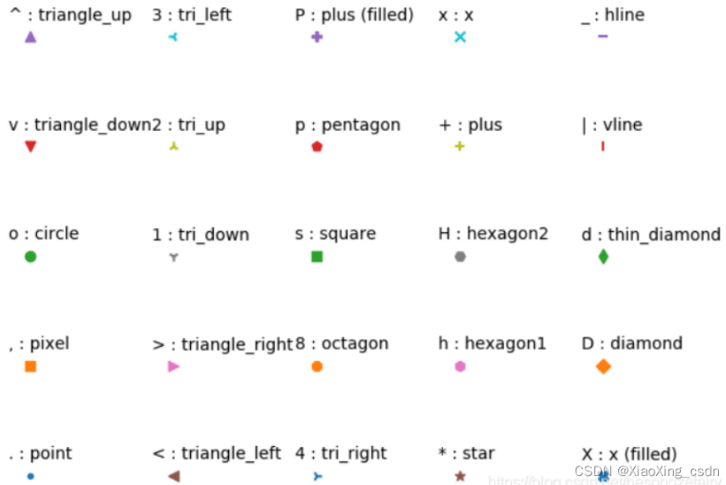

- [1. 绘图常识](#1-绘图常识)
  - [a. 颜色](#a-颜色)
  - [b. 图例](#b-图例)
- [2. 奇技淫巧](#2-奇技淫巧)
- [3. 高级绘图示例](#3-高级绘图示例)
  - [a. DET曲线绘制（GaussianScale）](#a-det曲线绘制gaussianscale)
  - [b. 频谱图绘制（仿Au配色）](#b-频谱图绘制仿au配色)
  - [c. 多Y轴绘制](#c-多y轴绘制)

# 1. 绘图常识
* 图类型：饼图、柱状图、直方图、箱线图、**旭日图**、**分组柱状图**
* `Figure` -> `Axes` -> `Axis` `(label, ticks, scale, format)` + `Legend` + `Title`

## a. 颜色

* 颜色合集：[CSDN贴](https://blog.csdn.net/CD_Don/article/details/88070453)、[知乎贴](https://zhuanlan.zhihu.com/p/65220518)，或者用`PowerToys`工具提取十六进制的RGB颜色
* 论文常用配色：
  + `['m', 'c', 'y', 'chocolate', 'g', 'b', 'r']`
  + `['crimson', 'deepskyblue', 'cornflowerblue']`

## b. 图例

* 论文常用图例：`['s', '^', 'v', '<', '>', '*', 'p']`
* 图例合集


# 2. 奇技淫巧
* 在PPT中绘图插入不常见符号方法：
  + MathType中输入tex代码，直接拷贝
  + Word中插入公式（LaTeX模式），然后转换，[参考](https://www.zhihu.com/question/40763253/answer/683622282)
  + Word中选中全部Unicode字符，按Alt+X，[参考](https://blog.csdn.net/handsome_for_kill/article/details/123313323)

* 设置字体、字号、线宽

```python
plt.rc('font', family='Times NR MT Pro') # 字体全局修改
# linewidth, linestyle, markersize -- for plot
# fontsize --> for ticks
# prop = {'family': '', 'size': 20} --> for label & legend
plt.xticks() # 当没有输入参数时，以元组形式返回当前xticks和labels
```

* [图例去重](https://www.jb51.net/article/209849.htm)

```python
from collections import OrderedDict
import matplotlib.pyplot as plt

handles, labels = plt.gca().get_legend_handles_labels()
by_label = OrderedDict(zip(labels, handles))
plt.legend(by_label.values(), by_label.keys())
```

* [自定义图例](https://www.cnblogs.com/MTandHJ/p/10850415.html#%E6%96%B9%E6%B3%951%E8%87%AA%E5%8A%A8%E6%A3%80%E6%B5%8B)

```python
import matplotlib.patches as mpatches
patch = mpatches.Patch(color='r', label='red')
plt.legend(handles=[patch])
```

* [图例设置透明度&宽度](https://blog.csdn.net/helunqu2017/article/details/78641290)

```python
# framealpha 控制透明度, frameon 控制边框
# handleheight/handlelength 分别控制宽和长
plt.legend(handles=patch_list, framealpha=0.5, handleheight=0.2, handlelength=1.0, frameon=True)
```

* `bbox_to_anchor`控制图例位置，`ncols`控制图例列数

* Ubuntu没有Times New Roman字体，（非管理员）解决方案：
  + [下载字体文件](https://www.foundertype.com/index.php/FontInfo/index/id/2892)，`.otf`格式
  + 在用户目录新建`.fonts`文件夹，将字体文件加入即可
  + 用`fc-list [:lang=en]`查看可用字体
  + 记得删除`matplotlib`缓存目录，可以用`mplt.get_cachedir()`或`mplt.get_configdir()`得到目录地址
  + 备注：[如果有管理员权限，还可以有另外几种方法安装字体](https://ubunlog.com/zh-CN/ubuntu%E4%B8%AD%E7%9A%84%E5%AD%97%E4%BD%93%E6%B7%BB%E5%8A%A0/)

* [自定义Scale](https://matplotlib.org/stable/gallery/scales/custom_scale.html)
  + 如果缩放不涉及`infinite`，则可以只定义`forward_func`和`inverse_func`函数实现：
    - `plt.xscale('function', functions=(forward_func, inverse_func))`
  + 如果缩放涉及到数据无效，则需要自己实现`class CustomScale(mscale.ScaleBase)`，DET的例子中实现了$\Phi^{-1}\left(\cdot\right)$缩放，`注意：将x和y轴限制到[0.08, 50]，效果最好`

* 设置坐标轴`Formatter`和`Locator`的方法及概念：

```python
ax.xaxis.set_major_formatter(xmajor_formatter) # 主坐标轴格式
ax.xaxis.set_minor_formatter(xminor_formatter) # 次坐标轴格式
ax.yaxis.set_major_formatter(ymajor_formatter)
ax.yaxis.set_minor_formatter(yminor_formatter)

ax.xaxis.set_major_locator(xmajor_locator) # 主坐标轴刻度
ax.xaxis.set_minor_locator(xminor_locator) # 次坐标轴刻度
ax.yaxis.set_major_locator(ymajor_locator)
ax.yaxis.set_minor_locator(yminor_locator)
```

  + `plt.ticklabel_format(style='sci', axis='x', scilimits=(0,0))`必须与`ScalarFormatter(useOffset=False, useMathText=True, useLocale=True)`搭配使用，[参考](https://discuss.dizzycoding.com/change-x-axes-scale-in-matplotlib/?amp=1)

* 控制图片大小：`_, axe = plt.subplots(figsize=(5.5, 4.8))`
* 隐藏某个轴（e.g. y轴）：

```python
axe.get_yaxis().set_visible(place_ylabelticks)  # 刻度、ylabel都被去除
axe.yaxis.set_major_formatter(NullFormatter())  # 保留刻度
```

# 3. 高级绘图示例

## a. DET曲线绘制（GaussianScale）

## b. 频谱图绘制（仿Au配色）

```python
def plot_spectrogram(write_path_list, spec, **kwargs):
    nfeat, nframe = spec.shape
    max_freq = 8000

    plt.figure(figsize=(10, 3))             # figsize for `8s` audio, finetune
    im = plt.imshow(spec, cmap='magma')     # gnuplot, plasma, magma, inferno
    cbar = plt.colorbar(im, ticks=np.arange(40, 130, 20))
    cbar.ax.set_yticklabels([f'{p} dB' for p in np.arange(40, 130, 20)], fontsize=13)
    plt.gca().invert_yaxis()
    xlabels = np.arange(0, nframe, 100)/100.0
    ylabels = np.arange(0, max_freq+1, 2000)
    plt.xticks(np.arange(0, nframe, 100), labels=xlabels, fontsize=13)
    plt.yticks(np.arange(0, max_freq+1, 2000)/max_freq*nfeat, labels=ylabels, fontsize=13)
    plt.xlabel('Time (s)', {'size': 15})
    plt.ylabel('Frequency (Hz)', {'size': 15})
    plt.tight_layout()
    if not isinstance(write_path_list, (list, tuple)):
        write_path_list = [write_path_list]
    [plt.savefig(path) for path in write_path_list]
    plt.close()

if __name__ == "__main__":
    import torch, torchaudio
    spec_extractor = torchaudio.transforms.Spectrogram(
        n_fft=512, win_length=400, hop_length=160,
        window_fn=torch.hamming_window
    )
    spec2db = torchaudio.transforms.AmplitudeToDB(top_db=80)

    audio_path = 'dataset/vox1_test_wav/id10305/3QrLepYlH6o/00001.wav'
    audio = torchaudio.load(audio_path, normalize=False)[0].float()
    spec = spec_extractor(audio.squeeze(0))
    spec = spec2db(spec)
    plot_spectrogram('au-spec.png', spec)
```

## c. 多Y轴绘制
