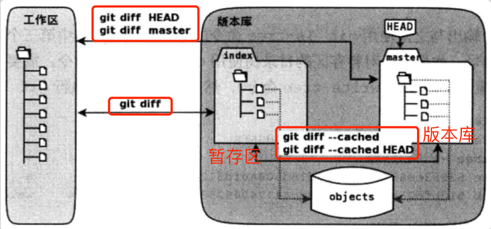

- [1. 配置](#1-配置)
- [2. git常识](#2-git常识)
- [3. 常用命令](#3-常用命令)
- [4. 奇淫巧技](#4-奇淫巧技)

# 1. 配置
* git 远程操作
  + 中文乱码：`git config --global core.quotepath false` ，[参考](https://zhuanlan.zhihu.com/p/133706032)。
  + 配置[公钥](https://segmentfault.com/a/1190000019394090)，`cat ~/.ssh/id_rsa.pub`，将内容拷贝到`Setting>>SSH and GPG keys`。
  + 配置[token](https://segmentfault.com/a/1190000040544939)，`Setting>>Developer setting>>Personal access tokens`，新建并授权登录。
  + 配置[hosts](https://juejin.cn/post/6844904193170341896)，需要将ip地址加入hosts文件，并使用[不更改权限修改host文件方法](https://blog.csdn.net/chasegan/article/details/107622167)。
* [git出现clone超时情况](https://blog.csdn.net/Hodors/article/details/103226958)：先config`http.proxy`，然后再`--unset`即可
  + `git config --list --global`
  + `git config --global http.proxy http://127.0.0.1:1080`、`git config --global https.proxy http://127.0.0.1:1080`
  + `git config --global --unset http.proxy`、`git config --global --unset https.proxy`

# 2. git常识
* 四个阶段：`workspace -> index -> local-repo -> remote-repo`
* gitignore
  + [样例文件](https://github.com/github/gitignore)
  + `.git/info/exclude`只会影响自己，不会影响他人
  + 多个目录下的`.gitignore`，就近原则
  + `!`表示例外规则，符合规则的文件重新加入版本控制
  + `\#`和`\!`：忽略以#和! 开头的文件
  + `\`结尾，表示过滤此目录及其子文件和子目录
  + `git add -f FILE.NAME`：强制加入版本控制
* `HEAD~`与`HEAD^`区别
  + [参考stack-overflow](https://stackoverflow.com/questions/2221658/whats-the-difference-between-head-and-head-in-git)
  + `~n`指向前n次提交（如果提交历史存在分叉，则默认第1个父提交路径）、`^n`指向第n个父提交
  + `<id>~n, n>=0`，`<id>`可以是`main/HEAD/v1.0`
  + `<id>~0`等价于`<id>`、`<id>~2`等价与`<id>~~/<id>^^/<id>^1^1`

# 3. 常用命令
* `push, pull`
  + github新建仓库，`git remote add origin URL`，或者`git remote set-url origin URL`
  + `git push origin <local-brh>:<remote-brh>`
    - 省略`<local-brh>`表示删除远程`<remote-brh>`分支，等同于`git push origin --delete <remote-brh>`；
    - 省略`<remote-brh>`表示将`<local-brh>`推送到与之关联的分支，如果不存在会在远程新建分支
  + `git pull origin <remote-brh>:<local-brh>`
    - 省略`<local-brh>`表示拉取远程`<remote-brh>`并与当前分支合并；
    - 省略分支`git pull origin`表示拉取与当前分支相关联的远程分支并合并；
    - 可以使用`git branch --set-upstream-to origin/<remote-brh> <local-brh>`建立两个分支的追踪关系
* `git commit --amend`的使用
  + `git commit --amend --help`
  + `git commit --amend -m 'NEW_MSG'`
  + 界面如何选中操作：`Alt+M`，[参考](https://unix.stackexchange.com/questions/396551/gnu-nano-2-dos-format-or-mac-format-on-linux)
* `git diff`
  + 比较不同分支的commits：`git diff master dev -- FILE.py`
  + 比较工作区和最近commit：`git diff HEAD -- FILE.py`
  + 比较暂存区和commit：`git diff --cached/--staged`
  + `git diff --stat`：总结改变状态，修改删除插入
  
* `git tag`
  + `git tag [-l <"v1.8*">]`，`git show v1.0`
  + 附注标签（annotated）`git tag -a v1.0 -m "msg"`
  + 轻量标签（lightweight）`git tag v1.0`
  + 历史标签（提交历史）`git tag -a v1.0 9fceb0`
  + 共享标签（push不传送tag）`git push origin v1.0`
  + `git tag -d v1.0`，`git push origin :refs/tags/v1.0`
* `git stash`
  + stash指定文件：`git stash push FILE -m 'msg'`
  + stash工作区：`git stash save [-u] -m 'msg'`，`-u`即`--include-untracked`
  + `git stash pop`之后出现冲突，合并完`stash`仍然存在且自动`add`合并内容
* `git submodule`
  + 新增：`git submodule add <url> <path>`；`clone`子仓库、修改`.gitmodules, .git/config`、新增`<path>, .git/modules/<path>`、并提交到`index`
  + [删除](https://stackoverflow.com/questions/1260748/how-do-i-remove-a-submodule)：相对应的`git rm --cached <path>`、删除`<path>, .git/modules/<path>`、修改`.gitmodules, .git/config`、`add, commit`提交修改
  + 初始化：`git clone`之后是空项目，要么`git clone --recurse-submodules`，要么`git submodule update --init [--recursive]`，其中`--recursive`表示处理嵌套子仓库

# 4. 奇淫巧技
* 回退单个文件：只针对`file`，不影响`workspace/index`的其他文件
  + `git checkout HEAD -- <file>`：将`workspace`内容回退到上次提交，并丢弃`index`内容
  + `git checkout <id>~n -- <file>`：将`index`内容回退到前n次提交，并保留`workspace`内容
  + `git restore restore <id>~n -- <file>`：将`workspace`内容回退到前n次提交，并保留`index`内容
