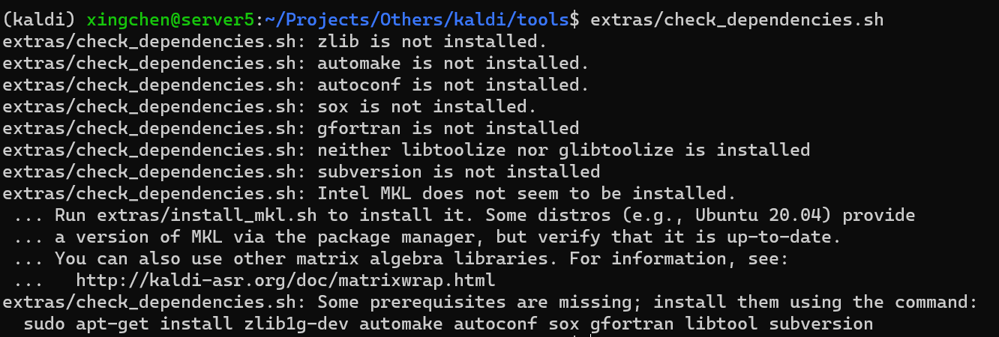

- [0. 编译\&安装（无root权限）](#0-编译安装无root权限)
  - [编译通用知识](#编译通用知识)
  - [安装步骤一览](#安装步骤一览)
  - [解决依赖项（重点）](#解决依赖项重点)
- [1. 基础](#1-基础)
- [2. 源码解读](#2-源码解读)

# 0. 编译&安装（无root权限）

## 编译通用知识

* 编译常识
  + Makefile支持的三种文件名：`Makefile、makefile、GNUmakefile`，`make`命令会首先查找当前目录是否存在该文件
  + [编译流程](https://zhuanlan.zhihu.com/p/504742628)：.cpp等源文件（文本）--> 经过预处理得到.i文件（文本） --> 经过编译器得到.s汇编文件（文本） --> 经过汇编器得到.o可重定位目标程序（二进制） --> 与系统库（e.g. printf.o）一同经过链接器，最终拿到可执行文件
  + 动态链接库文件：Linux是.so（shared Object）共享目标文件；Windows是.ddl（Dynamic Link Library）
  + 编译选项：`-lname`表示查找`libname.so`；`-L/path`表示在`/path`下查找；链接时，GCC的链接器ld就会前往`LD_LIBRARY_PATH`环境变量、`/etc/ld.so.cache`缓存文件和`/usr/lib, /lib`目录下去查找`libname.so`
  + `.PHONY: clean`，定义伪目标，可以直接`make clean`；`@gcc -c ...`，其中`@`表示取消回显

* `./configure --prefix /home/user/.local`：用于生成`Makefile`，没有`--prefix`默认放在`/usr/local`下，但没有root权限；所有安装包会共用`prefix`指定目录下的`bin, lib, include, share, lib64`这些文件夹
* 熟悉`make`命令
  + 安装：`make install`会生成`bin, lib, include`等
  + 清除：`make clean`会清除make产生的文件、`make distclean`会进一步清除configure文件
  + 卸载：`make uninstall`会清除`bin, lib, include`下的文件；[用`install_mainfest.txt`卸载](https://www.zhihu.com/question/20092756/answer/245869742)
  + `make -j16 && make install`：用多线程编译，编译成功则安装
  + `make`出错，如何定位具体错误：`make 2> make.error.log`，然后查看里面首次出现的error项

## 安装步骤一览

* 参考：[知乎贴](https://zhuanlan.zhihu.com/p/252873115)、[CSDN贴](https://blog.csdn.net/Leo9344/article/details/127290396)
* 下载kaldi：`git clone https://github.com/kaldi-asr/kaldi.git`或手动下载
* 在tools目录下，`extras/check_dependencies.sh`


* 先下载所有需要的安装包，可以用`depends_download_links.txt`提供的链接，`cat $FILE | grep -Ev "^#|^$" | xargs -i wget {}`

```shell
# depends_download_links.txt
https://ftp.gnu.org/gnu/libtool/libtool-2.2.4.tar.gz
http://ftp.tsukuba.wide.ad.jp/software/gcc/releases/gcc-10.4.0/gcc-10.4.0.tar.gz
https://github.com/sqlite/sqlite/archive/refs/tags/version-3.8.11.1.tar.gz
https://dlcdn.apache.org//apr/apr-1.7.4.tar.gz
https://github.com/libexpat/libexpat/releases/download/R_2_2_7/expat-2.2.7.tar.gz
https://dlcdn.apache.org//apr/apr-util-1.6.3.tar.gzr
https://dlcdn.apache.org/subversion/subversion-1.14.2.tar.gz
https://sourceforge.net/projects/sox/files/sox/14.4.2/sox-14.4.2.tar.gz/download
http://www.zlib.net/zlib-1.2.13.tar.gz
http://mirrors.kernel.org/gnu/m4/m4-1.4.13.tar.gz
http://mirrors.kernel.org/gnu/autoconf/autoconf-2.65.tar.gz
http://mirrors.kernel.org/gnu/automake/automake-1.11.tar.gz

https://github.com/xianyi/OpenBLAS/releases/download/v0.3.13/OpenBLAS-0.3.13.tar.gz
https://www.openfst.org/twiki/pub/FST/FstDownload/openfst-1.7.2.tar.gz
https://github.com/usnistgov/SCTK/archive/20159b5.tar.gz
https://github.com/burrmill/sph2pipe/archive/refs/tags/2.5.tar.gz
https://github.com/NVlabs/cub/archive/refs/tags/v1.8.0.tar.gz
```

* 依次解决依赖项（python，gfortran, sunversion, automake，...）
* 整体编译：在`tools`目录，`make -j16`（openfst, sctk, cub, sph2pipe），`make -j16 openblas`（OpenBLAS）；推荐安装在`tools`目录，后续`src`目录下编译会很方便
* 在`src`目录用OpenBLAS和CUDA来编译kaldi

```shell
./configure --mathlib=OPENBLAS --use-cuda --cudatk-dir=/usr/local/cuda-11.7 --shared
make clean depend -j $num_cpu; make -j $num_cpu
```

* 安装成功，可以用yesno数据集测试下！---》 `cd egs/yesno/s5 && bash run.sh`

## 解决依赖项（重点）

* 建议安装顺序：`libtool`；`gcc`；`apr, expat, apr-util, subversion`；`sox；zlib；m4, autoconf, automake`
* python
  + `mkdir tools/python && touch tools/python/.use_default_python`
  + 需要注释`tools/extras/check_dependencies.sh#L96-L100, #L111-L117`，后面编译openfst, cub, sph2pipe, stck都会检查（MKL没有影响）

* gfortran
  + 其实就是安装gcc，不过需要`--enable-languages=c,c++,fortran`
  + 解压后，先下载`mpc, mpfr, gmp, isl`，或者直接在目录内`contrib/download_prerequisites`
  + `./configure --disable-checking --enable-languages=c,c++,fortran --disable-multilib --prefix=/home/user/.local --enable-threads=posix`
  + 编译比较耗时，建议尽可能开启多个线程：`make -j16`
  + make出错：`Unable to find a suitable type for HOST_WIDE_INT`：可以`unset`掉`CPLUS_INCLUDE_PATH`；
  + 更进一步地，可以`unset LIBRARY_PATH CPATH C_INCLUDE_PATH PKG_CONFIG_PATH CPLUS_INCLUDE_PATH INCLUDE`
  + 参考链接：[手动安装gfortran](https://blog.csdn.net/tanshiqian/article/details/109226255)、[gcc安装make出错](https://www.cnblogs.com/haiyang21/p/10828134.html)

* gcc安装问题
  + 由于系统使用`11.2.0`，手动安装`10.4.0`：`/usr/lib/python3/dist-packages`记为`PYDIST_PKG`；导致随便输入命令都会，先在`$PYDIST_PKG/CommandNotFound/db/db.py#5 import apt_pkg`，然后会执行`$PYDIST_PKG/apt_pkg.cpython-310-x86_64-linux-gnu.so`，最后抛出`ImportError`
  + 由于`strings /usr/lib/x86_64-linux-gnu/libstdc++.so.6 | grep GLIBCXX`版本高于，`~/.local/lib64/libstdc++.so.6`，导致出错
  + 解决办法，[参考NOQA](https://www.jianshu.com/p/6424807b7e20)：把`/usr/lib/`下，`libstdc++.so.6.30`拷贝过去，然后在`~/.local/lib64/`下重新建立软链接
  + 解决办法：安装与系统相同版本的gcc

* 安装OpenBLAS问题
  + 编译错误：`/usr/bin/ld: cannot find -lgfortran: No such file or directory`
  + 解决办法：在`~/.bashrc`中`export CPLUS_INCLUDE_PATH, LIBRARY_PATH`

* subversion
  + 依次安装`apr, expat; apr-util; subversion`；需要先下载`sqlite-amalgamation`，直接放在`subversion`目录下解压即可
  + 记configure参数：`CFG_FLAGS="--with-apr=/home/user/.local --with-expat=/home/user/.local --prefix=/home/user/.local"`
  + `apr-util`：`./configure $CFG_FLAGS`
  + `subversion`：`./configure --with-apr-util=/home/user/.local --with-lz4=internal --with-utf8proc=internal $CFG_FLAGS`
  + 参考链接：[手动安装subversion](https://blog.csdn.net/accumulating_mocai/article/details/100157003)

* automake
  + 依次安装`m4, autoconf, automake`；`m4`需要先解决编译错误
  + `m4`编译错误：`#error "Please port gnulib freadahead.c to your platform ..."`，[解决方案](https://www.cnblogs.com/juwan/p/15994548.html)如下（`configure`前后都可以）
  + `sed -i 's/IO_ftrylockfile/IO_EOF_SEEN/' lib/*.c; echo "#define _IO_IN_BACKUP 0x100" >> lib/stdio-impl.h`
  + 然后照常安装`autoconf, automake`即可

# 1. 基础
* **Kaldi的I/O机制**
  + `"ark,s,cs:-"`表示我们读取的时候(这里是从标准输入读取)，我们期望key是排过序的(`s`)，而且读取它的程序是按照顺序(`cs`)来访问key，这样Kaldi程序可以使用少量的内存来随机的读取这个流。
    - 如果数据不太大并且我们很难保证顺序(比如说话人自适应的变换矩阵)，去掉`",s,cs"`也不会有什么问题。
    - 如果一个程序的参数有多个rspecifier，那么它通常会顺序的遍历第一个rspecifier，然后随机的访问后面的rspecifier。因此第一个rspecifier通常不需要`",s,cs"`。
  + `"scp,p:foo.scp"`：p指的是如果foo.scp里的指向的某些文件不存在，那么可以忽略这个错误；如果没有p选项，那么它就会crash。
  + 对于输出，选项`",t"`表示输出文本格式，比如`"ark,t:-"`；命令行选项`--binary`对于archive文件不起作用时，只能使用`",t"`选项。
* `copy-feats ark:train.ark   ark,t:-  | less`：通过管道和`less`命令来查看mfcc特征

# 2. 源码解读
* `parse_options.sh`：如果传入多个空参数，i.e. `bash run.sh --p1 --p2`, 脚本会卡死

```bash
for ((argpos=1; argpos<$#; argpos++)); do
  # ${!argpos}表示导出第argpos参数，同$argpos?
  if [ "${!argpos}" == "--config" ]; then
  argpos_plus1=$((argpos+1))
  config=${!argpos_plus1}
  [ ! -r $config ] && echo "$0: missing config '$config'" && exit 1
  . $config  # source the config file.
  fi
done
```

* `eval '[ -z "${'$name'+xxx}" ]'`：如果变量name未定义，则返回真
* `[ ! -z "${cmd+xxx}" ] && [ -z "$cmd" ]`：检查变量cmd已定义且非空
* `EOF`妙用之输出信息
  + `cat >&2 <<EOF...MessageToPrint...EOF`
  + `cat <<EOF...MessageToPrint...EOF`
