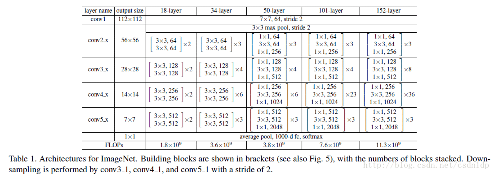
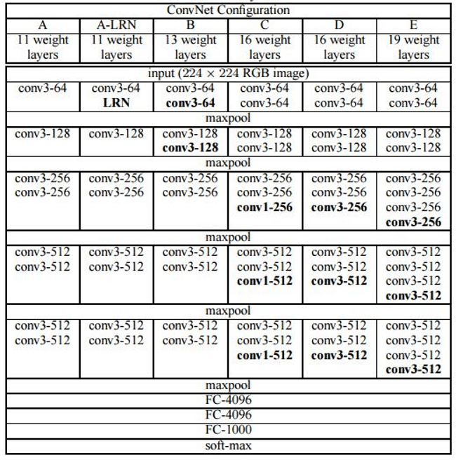
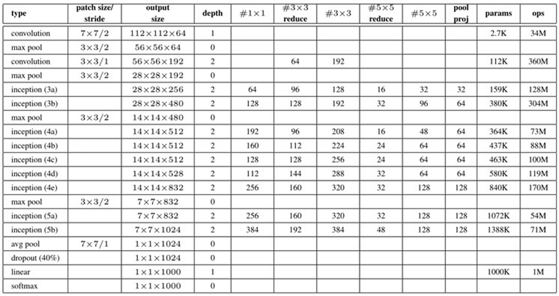
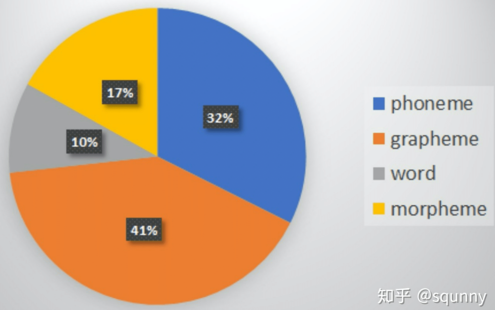
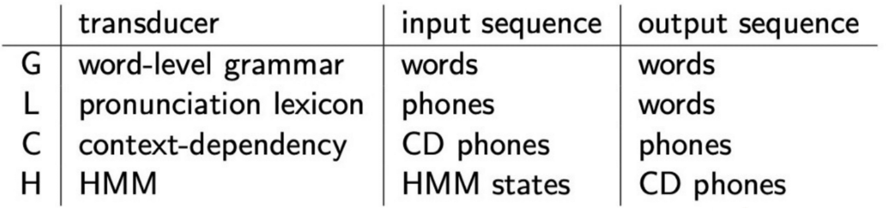

- [1. 深度学习](#1-深度学习)
  - [算法基础](#算法基础)
  - [训练技巧](#训练技巧)
  - [网络结构](#网络结构)
- [2. 语音通用](#2-语音通用)
- [3. 声纹（ASV）](#3-声纹asv)
  - [进阶知识](#进阶知识)
  - [评分规整（score-normalization）](#评分规整score-normalization)
- [4. 对抗样本（AE）](#4-对抗样本ae)
- [5. 识别（ASR）](#5-识别asr)
  - [基础知识](#基础知识)
  - [奇技淫巧](#奇技淫巧)

# 1. 深度学习

## 算法基础

* LDA和PLDA
  + [LDA算法原理](https://www.cnblogs.com/pinard/p/6244265.html)
  + [PLDA详解，从原理、参数估计到代码](https://blog.csdn.net/JackyTintin/article/details/79803501?spm=1001.2014.3001.5502)
* [EM算法，Expectation-Maximum](https://www.cnblogs.com/pinard/p/6912636.html)
  + overview：从观测数据中（存在未观测到的隐含数据），估计已知分布的参数；
  + EM算法可以保证收敛到一个稳定点，但是却不能保证收敛到全局的极大值点，因此它是局部最优的算法

* [谱聚类，Spectral Clustering](https://www.cnblogs.com/pinard/p/6221564.html)
  + 基础定义：$V$代表数据集中所有的点$\{v_1, v_2, \cdots, v_n\}$、K邻近法定义相似矩阵$W$、拉普拉斯矩阵$L=D-W$
  + `overview`
    - $n$条`embedding`得到相似度矩阵$M$，通过裁剪得到邻接矩阵$W\in\mathbb{R}^{n\times n}$
    - 求矩阵$L$或$D^{-1/2}L D^{1/2}$，$k$个最小特征值
    - 将$k$个特征向量组成的矩阵$H\in\mathbb{R}^{n\times k}$，并做行标准化
    - 用`kmeans`对新样本$\{x_i\in\mathbb{R}^{k\times 1}\mid i=1,2,\cdots,n\}$做聚类，聚类数目不一定是$k$
  + `RatioCut`：最小化子图间权重和，同时最大化子图节点数
    - i.e. 最小化，${\rm{RatioCut}}(A_1, A_2, \cdots, A_k) = \frac{1}{2}\sum\limits^{k}_{i=1}\frac{W(A_i, \overline{A_i})}{\left|A_i\right|}$，其中 $W(A, B) = \sum\limits_{i\in A, j\in B}\omega_{ij}$
    - 引入$k$个指示向量$h_j\in\mathbb{R}^{n\times 1}$，组成$H=\{h_1, h_2, \cdots, h_k\}\in\mathbb{R}^{n\times k}$，其中 $h_{ij}=\begin{cases}0 & v_i \notin A_j \\ \frac{1}{\sqrt{\left|A_j\right|}} & v_i \in A_j\end{cases}$，$h_j$是单位正交基
    - 等价变换优化目标：${\rm{RatioCut}}(*) = \sum\limits^{k}_{i=1}h^T_i L h_i = {\;\rm tr}(H^T L H)$，即 $\underbrace{\arg \min }_H {\;\rm tr}\left(H^T L H\right)$ s.t. $H^T H=I$
    - 找到$L$最小的$k$个特征值（$k\ll n$），将对应的$k$个特征向量组成矩阵$H\in\mathbb{R}^{n\times k}$，此时对应的切图效果最好
  + `NCut`：最小化子图间权重和，同时最大化子图内节点度的和，即子图内权重和，$vol(A) := \sum\limits_{i\in A}d_i$
    + i.e. 最小化，${\rm{NCut}}(A_1, A_2, \cdots, A_k) = \frac{1}{2}\sum\limits^{k}_{i=1}\frac{W(A_i, \overline{A_i})}{vol(A_i)}$
    + 同时重新定义指示向量$h_j\in\mathbb{R}^{n\times 1}$，$h_{ij}=\begin{cases}0 & v_i \notin A_j \\ \frac{1}{\sqrt{vol(A_j)}} & v_i \in A_j\end{cases}$
    - 等价变换优化目标：${\rm{NCut}}(*) = \sum\limits^{k}_{i=1}h^T_i L h_i = {\;\rm tr}(H^T L H)$，即 $\underbrace{\arg \min }_H {\;\rm tr}\left(H^T L H\right)$ s.t. $H^TDH=I$
    - 进一步地，令$H=D^{-1/2}F$，则优化目标为：$\underbrace{\arg \min }_F {\;\rm tr}\left(F^TD^{-1/2} L D^{-1/2}F\right)$ s.t. $F^TF=I$
    - $D^{-1/2} L D^{-1/2}$相当于对拉普拉斯矩阵$L$做了一次标准化，即$\frac{L_{ij}}{\sqrt{d_i * d_j}}$，后面正常求特征值特征向量，然后聚类即可

* [PCA，Principal Components Analysis](https://www.cnblogs.com/pinard/p/6239403.html)

## 训练技巧

* `softmax`使用`temperature`缓解梯度过大问题：`temperature`越大输出概率分布越平滑，越小则越尖锐；可以考虑使用自适应`temperature`，e.g. $\tau = \frac{\tau_0}{1 + \log t}$；[知乎贴](https://zhuanlan.zhihu.com/p/132785733)、[Role of temperature in Softmax](https://stats.stackexchange.com/questions/527080/what-is-the-role-of-temperature-in-softmax)
* [学习率与`batchsize`](https://zhuanlan.zhihu.com/p/64864995)：`batchsize`增加$K$倍，要保证权重的方差一致，学习率要增加$\sqrt K$倍；但经验来看增加$K$倍效果更好
* [网络宽度与深度](https://zhuanlan.zhihu.com/p/64219398)
  + 宽度让每一层学到更丰富的特征（e.g. 不同方向、不同频率的纹理）；深度让网络的表达能力更强，层与层间需要的`gap`减小
  + 宽度计算量`O(N)`、深度计算量`O(N^2)`；增加宽度提升性能更快（存在上限）；增加宽度对GPU更友好
* `softmax`使用混合精度训练，由于$\frac{\mathbf{q}_i \cdot \mathbf{k}_j}{\sqrt{d}}$过大，导致`overflow issue in training`：[解决方案，见WavLM原文](https://ieeexplore.ieee.org/abstract/document/9814838/)
  + `softmax`函数性质：${\rm softmax}(\mathbf{x}+\alpha)_k = {\rm softmax}(\mathbf{x})_k$
  + 先缩放再减去最大值：$\alpha_{i, j}\propto \exp\frac{\mathbf{q}_i \cdot \mathbf{k}_j}{\sqrt{d}} = \exp\{(\frac{\mathbf{q}_i \cdot \mathbf{k}_j}{c\sqrt{d}} - \max\limits_{j^{\prime}\le T}\frac{\mathbf{q}_i \cdot \mathbf{k}_{j^\prime}}{c\sqrt{d}})\times c\}$；论文中`c=32`

## 网络结构

* **ResNet**


* **VGG**


* [Inception](https://zhuanlan.zhihu.com/p/30756181)


# 2. 语音通用
* 语音读取/写入：`scipy.io.wavfile.read()/write()`、`torchaudio.load()/save()`
* 特征提取：[LFR](https://github.com/foamliu/Speaker-Embeddings/blob/master/utils.py#L184)，跳帧/重复帧，[见`funasr.models.frontent.wav_frontend.apply_lfr`](https://github.com/alibaba-damo-academy/FunASR/blob/main/funasr/models/frontend/wav_frontend.py#L57)
* 语音分离指标：`SDR`、`SI-SDR`、[`SI-SDRi`](https://oecd.ai/fr/catalogue/metrics/scale-invariant-signal-to-distortion-ratio-improvement-%28si-sdri%29)；`SI-SDR`相比`SDR`考虑了分离信号的缩放和排列；`SI-SDRi`为`0dB`表示没有提升，越大越好，`SI-SDRi`是比较鲁棒的评价指标

# 3. 声纹（ASV）

## 进阶知识

* 瘦深网络优于宽浅网络：宽度指特征图多少，深度提高使得每层表征之间的gap变小，网络越容易学习；
* `wespeaker`训练技巧：`warmup`要足够达到一个较低的loss或者`acc=60%`、`margin-update`要足够缓使得loss上升没那么剧烈

## 评分规整（score-normalization）

# 4. 对抗样本（AE）
* 归一化的影响，归一化本身也是模型参数的一部分

```python
data_transforms = torchvision.transforms.Compose([
        transforms.Resize(256),
        transforms.CenterCrop(224),
        transforms.ToTensor(),
        transforms.Normalize([0.485, 0.456, 0.406], [0.229, 0.224, 0.225])
        # transforms.Normalize([.5, .5, .5], [.5, .5, .5])
])
```

* 可以将输入样本当做参数，创建优化器，从而产生对抗样本--->[参考](https://mathpretty.com/10499.html)

# 5. 识别（ASR）

## 基础知识

* 输入token：
  + 类型：phoneme, grapheme, word, morpheme, byte
  + 工具：[sentencepiece](https://github.com/google/sentencepiece)
* Weighted Finite-State Transducer (WFST)
  + [参考](http://fancyerii.github.io/wfst/decoder/)
* `HCLG, HLG, TLG`
  + 
  + H：HMM transducer
  + C：Context-dependency transducer
  + L：pronunciation Lexion
  + G：word-level Grammar
* 声学模型、phone上下文、发音词典和语言模型
* Sequence generation problems
  + Neural Machine Translation (`NMT`), Image caption generation (`ICG`), Optical Character Recognition (`OCR`), and speech recognition (`ASR`).
  + These models receive an vector (`audio, image, text, ...`) to learn to generate some text sequence, and utlize a `beam search decoder` fused with a `language model` to boost the results.

## 奇技淫巧

* `gated relative position bias`：[微软`WavLM`论文](https://ieeexplore.ieee.org/abstract/document/9814838/)，引入和内容相关的可学习偏置，对识别任务有帮助；其中`reset, update`感觉和`GRU`有点关系
