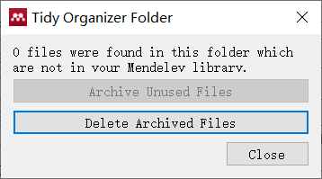

- [Mendeley](#mendeley)
- [IguanaTex](#iguanatex)
- [windows](#windows)
- [markdown高级用法](#markdown高级用法)
- [jupyter-notebook](#jupyter-notebook)
- [tmux](#tmux)

# Mendeley
* [PC间数据的迁移](https://zodiac911.github.io/blog/20190705.html)
  1. 条件：两台PC的Mendeley安装路径完全一致
  2. 准备：将`NEW_PDFs_ORGANIZE_DIR`添加到当前电脑`Tools>>Options>>File Organizer`下，然后`Apply`，此时mendeley会将PDF文件拷贝到该目录下；点击`Sync`等完成后退出软件。
  3. 备份：将当前电脑的`NEW_PDFs_ORGANIZE_DIR`和`C:\Users\<USER_NAME>\AppData\Local\Mendeley Ltd`目录压缩保存
  4. 迁移：在新电脑下，将两个压缩文件解压到其对应文件夹，打开Mendeley即可迁移成功
* [PC间文件同步](https://blog.sciencenet.cn/blog-1748660-1268891.html)
  + 在两台电脑均设置`Watch Folders`，并在坚果云同步；但还未动手实践过。
* `Tidy up`

# IguanaTex
* [IguanaTex]((http://www.jonathanleroux.org/software/iguanatex/download.html))原理，[参考](https://www.programminghunter.com/article/96961598267/)：①将Tex代码编译生成pdf，②然后用`pdfcrop`裁剪，③最后使用`tex2img>>pdfiumdraw`，将图片转换成背景透明的`emf`格式。
* 如果不使用`latexDVI`工具生成，则需要安装[`Ghostscript`](https://ghostscript.com/releases/gsdnld.html)、`ImageMagick` >> [官网](http://www.imagemagick.org/script/download.php#windows) or [GitHub](https://github.com/imagemagick/imagemagick)
* 如果使用`vector`生成，需要安装`TeX2img` >> [DirectDownload](https://www.ms.u-tokyo.ac.jp/~abenori/soft/bin/TeX2img_2.1.0.zip) or [GitHub](https://github.com/abenori/TeX2img)
* [dpi和ppi的区别](https://zhuanlan.zhihu.com/p/146713168)：前者是用于印刷的单位，是每英寸能打印的“理论”墨点数；后者表示图像分辨率单位，是每英寸的像素点数。
* [bitmap v.s. vector](https://xd.adobe.com/ideas/principles/app-design/bitmap-vs-vector-images-difference/)
  + bitmap文件更大，色彩更丰富，但缩放会牺牲分辨率 >> 如用于展示
  + vector文件更小，resolution-independent缩放不会牺牲分辨率 >> 如用于图标设计
* `bp`和`pt`的区别，[参考](https://github.com/ustctug/ustcthesis/issues/4)：`pt`是欧美传统排版的长度单位`1 inch = 72.27 pt`；PostScript等电子排版领域中point都是`bp`，`1 inch = 72 bp`。而Word中的point（磅）是PostScript point，也就是TeX中的bp。

# windows
* [Office密钥地址](https://www.coolhub.top/tech-articles/products.html)
* Word用latex插入公式编号，`a+b=c#(1)`，`#`将光标移到行尾

# markdown高级用法
* 内容隐藏展开：`

List demo

 ... 

`
* 脚注：`main text insert footnote[^1][^fnId].`、`[^fnId]: footnote supports multiple paragraphs and code.`
* 高亮文本：`===highlight words===`，或者`<mark>highlight words</mark>`
* 使用[表情符号简码](https://gist.github.com/rxaviers/7360908)，但不同应用程序可能显示不同；`:one:`,  `:arrow_right:`, 等等；[GitHub Emojis Picker](https://github-emoji-picker.rickstaa.dev/)

# jupyter-notebook
* `pip install ipykernel` + `VSCode Jupyter插件`，`Select Kernel`即可运行
* `!cd`在子shell运行，`%cd`当前shell运行；[参考](https://stackoverflow.com/questions/53188176/fail-to-change-directory-shell-command-in-jupyternotebook-or-jupyterlab-sessi)

# tmux
* 窗口`attach`状态，意外关闭当前终端后，程序仍然不中断